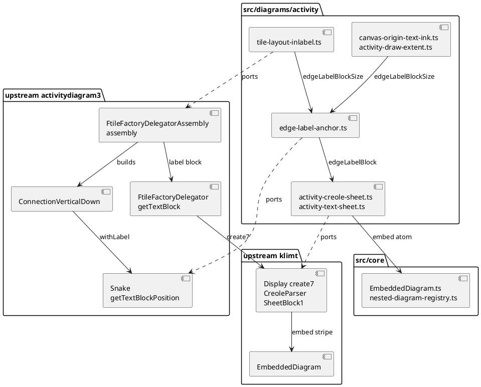

# Component map (aae)

Upstream classes (left) and the port modules this mission reads or changes (right). Edges name the call.

```plantuml
@startuml
package "upstream activitydiagram3" {
  [FtileFactoryDelegator\ngetTextBlock] as JGet
  [FtileFactoryDelegatorAssembly\nassembly] as JAsm
  [ConnectionVerticalDown] as JCon
  [Snake\ngetTextBlockPosition] as JSnake
}
package "upstream klimt" {
  [Display create7\nCreoleParser\nSheetBlock1] as JCreole
  [EmbeddedDiagram] as JEmb
}
package "src/diagrams/activity" {
  [edge-label-anchor.ts] as TAnchor
  [activity-creole-sheet.ts\nactivity-text-sheet.ts] as TSheet
  [tile-layout-inlabel.ts] as TInlabel
  [canvas-origin-text-ink.ts\nactivity-draw-extent.ts] as TCanvas
}
package "src/core" {
  [EmbeddedDiagram.ts\nnested-diagram-registry.ts] as TEmb
}
JGet --> JCreole : create7
JCreole --> JEmb : embed stripe
JAsm --> JGet : label block
JAsm --> JCon : builds
JCon --> JSnake : withLabel
TAnchor --> TSheet : edgeLabelBlock
TSheet --> TEmb : embed atom
TInlabel --> TAnchor : edgeLabelBlockSize
TCanvas --> TAnchor : edgeLabelBlockSize
TAnchor ..> JSnake : ports
TInlabel ..> JAsm : ports
TSheet ..> JCreole : ports
@enduml
```
