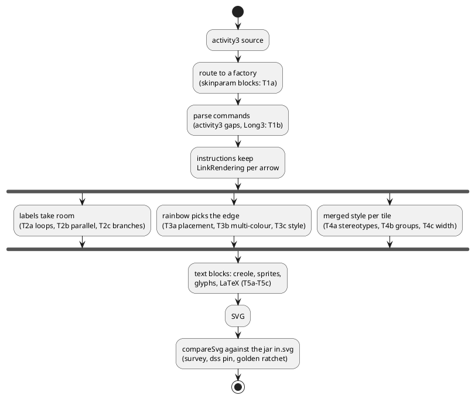

# Data flow: where an activity row's diffs arise

Each batch owns one stage. A row's first diff points at the earliest stage that departs from the jar.

```plantuml
@startuml
start
:activity3 source;
:route to a factory\n(skinparam blocks: T1a);
:parse commands\n(activity3 gaps, Long3: T1b);
:instructions keep\nLinkRendering per arrow;
fork
  :labels take room\n(T2a loops, T2b parallel, T2c branches);
fork again
  :rainbow picks the edge\n(T3a placement, T3b multi-colour, T3c style);
fork again
  :merged style per tile\n(T4a stereotypes, T4b groups, T4c width);
end fork
:text blocks: creole, sprites,\nglyphs, LaTeX (T5a-T5c);
:SVG;
:compareSvg against the jar in.svg\n(survey, dss pin, golden ratchet);
stop
@enduml
```
