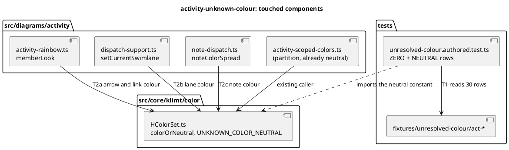

# Component map

The modules this mission touches (bold labels on the edges name the task).

```plantuml
@startuml
title activity-unknown-colour: touched components
package "src/core/klimt/color" {
  component "HColorSet.ts\ncolorOrNeutral, UNKNOWN_COLOR_NEUTRAL" as HC
}
package "src/diagrams/activity" {
  component "activity-rainbow.ts\nmemberLook" as RB
  component "dispatch-support.ts\nsetCurrentSwimlane" as SW
  component "note-dispatch.ts\nnoteColorSpread" as NT
  component "activity-scoped-colors.ts\n(partition, already neutral)" as SC
}
package "tests" {
  component "unresolved-colour.authored.test.ts\nZERO + NEUTRAL rows" as G
  component "fixtures/unresolved-colour/act-*" as F
}
RB --> HC : T2a arrow and link colour
SW --> HC : T2b lane colour
NT --> HC : T2c note colour
SC --> HC : existing caller
G --> F : T1 reads 30 rows
G ..> HC : imports the neutral constant
@enduml
```
