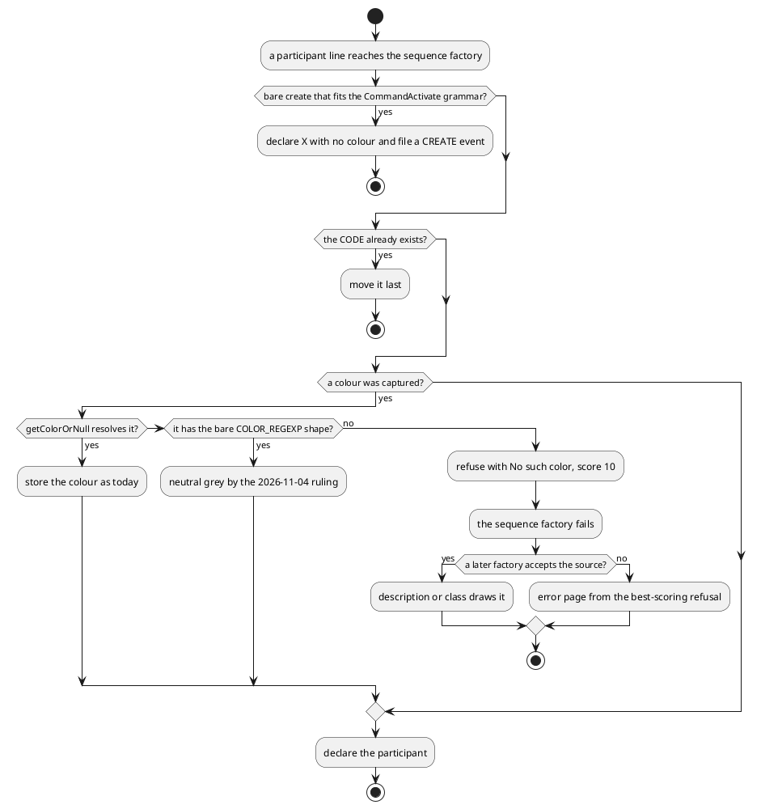

# Data flow: one sequence participant line after T2 and T3

```plantuml
@startuml
start
:a participant line reaches the sequence factory;
if (bare create that fits the CommandActivate grammar?) then (yes)
  :declare X with no colour and file a CREATE event;
  stop
endif
if (the CODE already exists?) then (yes)
  :move it last;
  stop
endif
if (a colour was captured?) then (yes)
  if (getColorOrNull resolves it?) then (yes)
    :store the colour as today;
  elseif (it has the bare COLOR_REGEXP shape?) then (yes)
    :neutral grey by the 2026-11-04 ruling;
  else (no)
    :refuse with No such color, score 10;
    :the sequence factory fails;
    if (a later factory accepts the source?) then (yes)
      :description or class draws it;
    else (no)
      :error page from the best-scoring refusal;
    endif
    stop
  endif
endif
:declare the participant;
stop
@enduml
```
