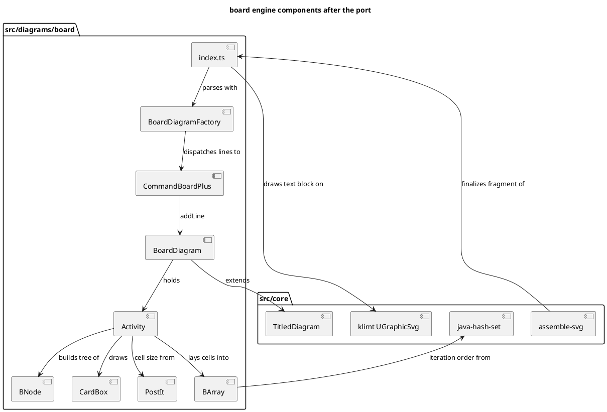

# Component map

The ported files and the shared seams they use. Engines import from `src/core/` only.

```plantuml
@startuml
title board engine components after the port
package "src/diagrams/board" {
  [index.ts] as idx
  [BoardDiagramFactory] as fac
  [CommandBoardPlus] as cmd
  [BoardDiagram] as dia
  [Activity] as act
  [BNode] as node
  [BArray] as arr
  [CardBox] as card
  [PostIt] as post
}
package "src/core" {
  [TitledDiagram] as td
  [java-hash-set] as jhs
  [klimt UGraphicSvg] as ug
  [assemble-svg] as asm
}
idx --> fac : parses with
fac --> cmd : dispatches lines to
cmd --> dia : addLine
dia --> td : extends
dia --> act : holds
act --> node : builds tree of
act --> arr : lays cells into
arr --> jhs : iteration order from
act --> card : draws
act --> post : cell size from
idx --> ug : draws text block on
asm --> idx : finalizes fragment of
@enduml
```
