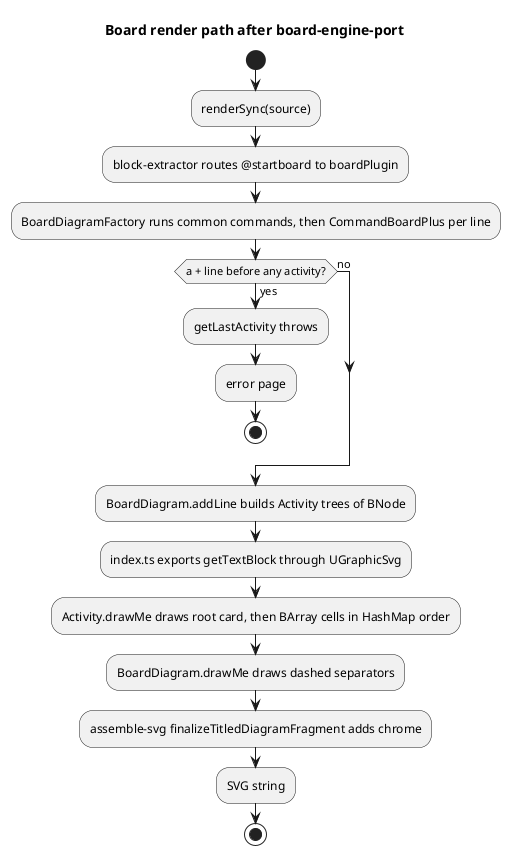

# Data flow

How a board source becomes SVG after the port (D1, D2).

```plantuml
@startuml
title Board render path after board-engine-port
start
:renderSync(source);
:block-extractor routes @startboard to boardPlugin;
:BoardDiagramFactory runs common commands, then CommandBoardPlus per line;
if (a + line before any activity?) then (yes)
  :getLastActivity throws;
  :error page;
  stop
else (no)
endif
:BoardDiagram.addLine builds Activity trees of BNode;
:index.ts exports getTextBlock through UGraphicSvg;
:Activity.drawMe draws root card, then BArray cells in HashMap order;
:BoardDiagram.drawMe draws dashed separators;
:assemble-svg finalizeTitledDiagramFragment adds chrome;
:SVG string;
stop
@enduml
```
