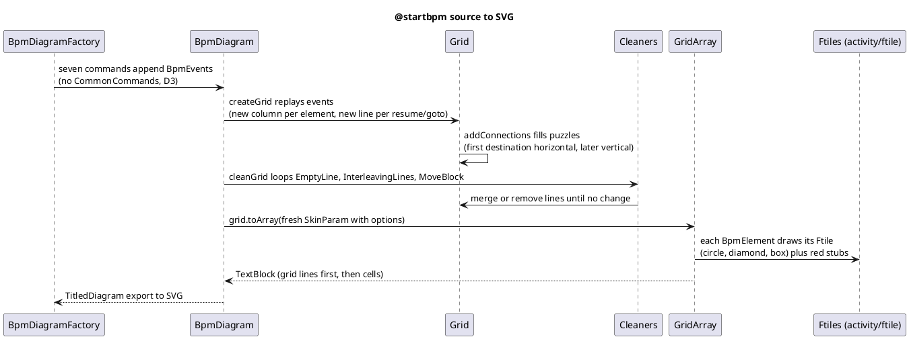

# Data flow — a `@startbpm` source to SVG

```plantuml
@startuml
title @startbpm source to SVG
participant "BpmDiagramFactory" as F
participant "BpmDiagram" as D
participant "Grid" as G
participant "Cleaners" as C
participant "GridArray" as A
participant "Ftiles (activity/ftile)" as T
F -> D : seven commands append BpmEvents\n(no CommonCommands, D3)
D -> G : createGrid replays events\n(new column per element, new line per resume/goto)
G -> G : addConnections fills puzzles\n(first destination horizontal, later vertical)
D -> C : cleanGrid loops EmptyLine, InterleavingLines, MoveBlock
C -> G : merge or remove lines until no change
D -> A : grid.toArray(fresh SkinParam with options)
A -> T : each BpmElement draws its Ftile\n(circle, diamond, box) plus red stubs
A --> D : TextBlock (grid lines first, then cells)
D --> F : TitledDiagram export to SVG
@enduml
```
