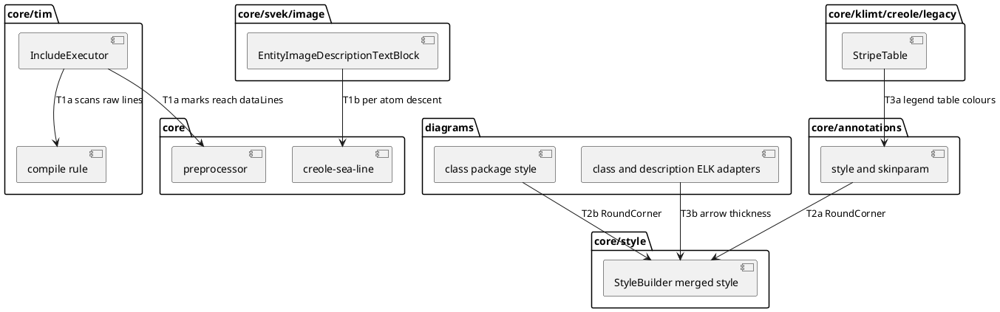

# Components touched

```plantuml
@startuml
package "core/tim" {
  [IncludeExecutor] as inc
  [compile rule] as rule
}
package "core" {
  [preprocessor] as pre
  [creole-sea-line] as sea
}
package "core/svek/image" {
  [EntityImageDescriptionTextBlock] as tb
}
package "core/annotations" {
  [style and skinparam] as ann
}
package "core/klimt/creole/legacy" {
  [StripeTable] as tab
}
package "core/style" {
  [StyleBuilder merged style] as sb
}
package "diagrams" {
  [class package style] as cls
  [class and description ELK adapters] as elk
}
inc --> rule : T1a scans raw lines
inc --> pre : T1a marks reach dataLines
tb --> sea : T1b per atom descent
ann --> sb : T2a RoundCorner
cls --> sb : T2b RoundCorner
elk --> sb : T3b arrow thickness
tab --> ann : T3a legend table colours
@enduml
```
