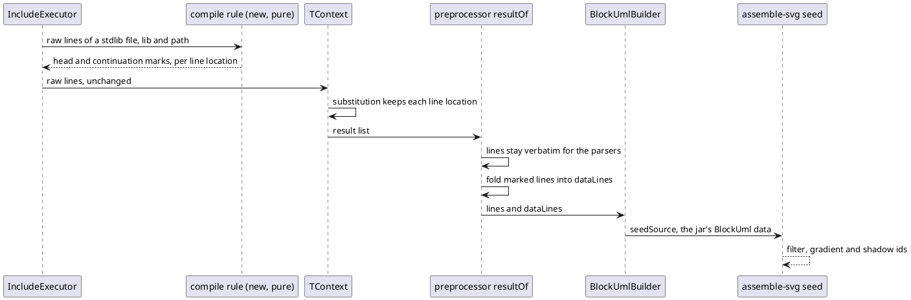

# Data flow: where the seed comes from (D2)

```plantuml
@startuml
participant "IncludeExecutor" as inc
participant "compile rule (new, pure)" as rule
participant "TContext" as tim
participant "preprocessor resultOf" as res
participant "BlockUmlBuilder" as blk
participant "assemble-svg seed" as seed
inc -> rule : raw lines of a stdlib file, lib and path
rule --> inc : head and continuation marks, per line location
inc -> tim : raw lines, unchanged
tim -> tim : substitution keeps each line location
tim -> res : result list
res -> res : lines stay verbatim for the parsers
res -> res : fold marked lines into dataLines
res -> blk : lines and dataLines
blk -> seed : seedSource, the jar's BlockUml data
seed --> seed : filter, gradient and shadow ids
@enduml
```
