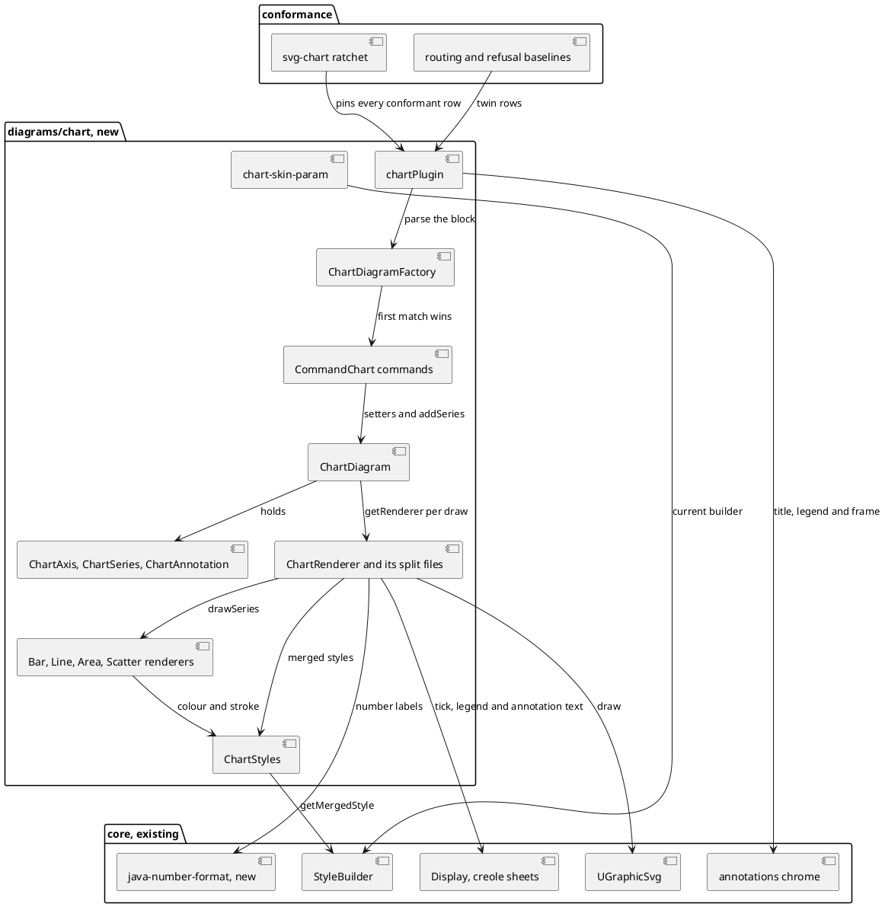

# Components touched

```plantuml
@startuml
package "diagrams/chart, new" {
  [ChartDiagramFactory] as factory
  [CommandChart commands] as commands
  [ChartDiagram] as diagram
  [ChartAxis, ChartSeries, ChartAnnotation] as model
  [ChartRenderer and its split files] as renderer
  [Bar, Line, Area, Scatter renderers] as series
  [ChartStyles] as styles
  [chart-skin-param] as skin
  [chartPlugin] as plugin
}
package "core, existing" {
  [StyleBuilder] as sb
  [Display, creole sheets] as display
  [UGraphicSvg] as ug
  [annotations chrome] as chrome
  [java-number-format, new] as num
}
package "conformance" {
  [svg-chart ratchet] as rat
  [routing and refusal baselines] as gates
}
plugin --> factory : parse the block
factory --> commands : first match wins
commands --> diagram : setters and addSeries
diagram --> model : holds
diagram --> renderer : getRenderer per draw
renderer --> series : drawSeries
renderer --> styles : merged styles
series --> styles : colour and stroke
styles --> sb : getMergedStyle
renderer --> display : tick, legend and annotation text
renderer --> num : number labels
renderer --> ug : draw
skin --> sb : current builder
plugin --> chrome : title, legend and frame
rat --> plugin : pins every conformant row
gates --> plugin : twin rows
@enduml
```
