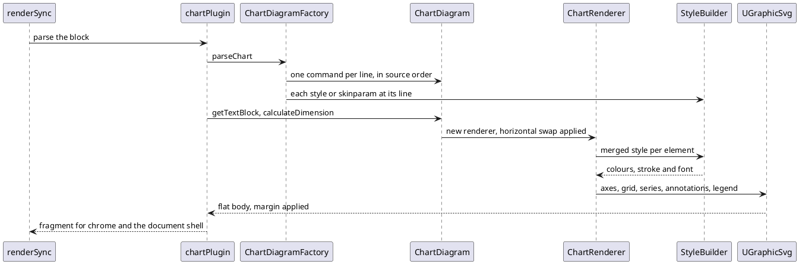
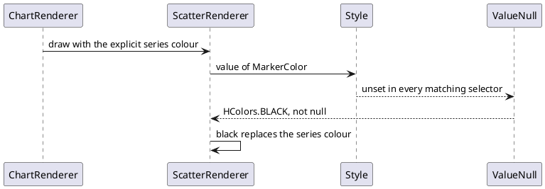

# Data flow: one chart through the new engine

```plantuml
@startuml
participant "renderSync" as sync
participant "chartPlugin" as plugin
participant "ChartDiagramFactory" as factory
participant "ChartDiagram" as diagram
participant "ChartRenderer" as renderer
participant "StyleBuilder" as sb
participant "UGraphicSvg" as ug
sync -> plugin : parse the block
plugin -> factory : parseChart
factory -> diagram : one command per line, in source order
factory -> sb : each style or skinparam at its line
plugin -> diagram : getTextBlock, calculateDimension
diagram -> renderer : new renderer, horizontal swap applied
renderer -> sb : merged style per element
sb --> renderer : colours, stroke and font
renderer -> ug : axes, grid, series, annotations, legend
ug --> plugin : flat body, margin applied
plugin --> sync : fragment for chrome and the document shell
@enduml
```

# Data flow: why a scatter draws black

```plantuml
@startuml
participant "ChartRenderer" as renderer
participant "ScatterRenderer" as scatter
participant "Style" as style
participant "ValueNull" as nul
renderer -> scatter : draw with the explicit series colour
scatter -> style : value of MarkerColor
style --> nul : unset in every matching selector
nul --> scatter : HColors.BLACK, not null
scatter -> scatter : black replaces the series colour
@enduml
```
