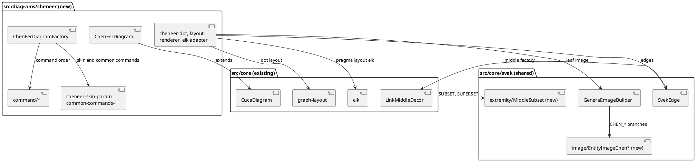

# Component map

New files and the shared modules they use. Shared ports land at upstream's package (D2).

```plantuml
@startuml
package "src/diagrams/cheneer (new)" {
  component ChenEerDiagram
  component ChenEerDiagramFactory
  component "command/*" as CMD
  component "cheneer-skin-param\ncommon-commands-1" as SK
  component "cheneer-dot, layout,\nrenderer, elk adapter" as PIPE
}
package "src/core/svek (shared)" {
  component "image/EntityImageChen* (new)" as IMG
  component "extremity/MiddleSubset (new)" as MS
  component GeneralImageBuilder
  component SvekEdge
}
package "src/core (existing)" {
  component CucaDiagram
  component LinkMiddleDecor
  component "graph-layout" as GL
  component elk
}
ChenEerDiagram --> CucaDiagram : extends
ChenEerDiagramFactory --> CMD : command order
ChenEerDiagramFactory --> SK : skin and common commands
PIPE --> GeneralImageBuilder : leaf image
GeneralImageBuilder --> IMG : CHEN_* branches
PIPE --> SvekEdge : edges
SvekEdge --> LinkMiddleDecor : middle factory
LinkMiddleDecor --> MS : SUBSET, SUPERSET
PIPE --> GL : dot layout
PIPE --> elk : pragma layout elk
@enduml
```
