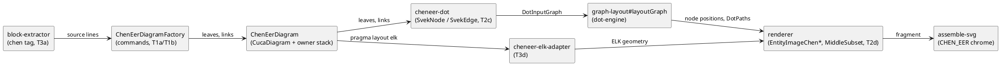

# Data flow

One `@startchen` source, from the block to the SVG. ELK replaces the dot-engine step when `!pragma layout elk` is set (D5).

```plantuml
@startuml
left to right direction
rectangle "block-extractor\n(chen tag, T3a)" as BE
rectangle "ChenEerDiagramFactory\n(commands, T1a/T1b)" as F
rectangle "ChenEerDiagram\n(CucaDiagram + owner stack)" as D
rectangle "cheneer-dot\n(SvekNode / SvekEdge, T2c)" as DOT
rectangle "graph-layout#layoutGraph\n(dot-engine)" as GL
rectangle "cheneer-elk-adapter\n(T3d)" as ELK
rectangle "renderer\n(EntityImageChen*, MiddleSubset, T2d)" as R
rectangle "assemble-svg\n(CHEN_EER chrome)" as A
BE --> F : source lines
F --> D : leaves, links
D --> DOT : leaves, links
DOT --> GL : DotInputGraph
GL --> R : node positions, DotPaths
D --> ELK : pragma layout elk
ELK --> R : ELK geometry
R --> A : fragment
@enduml
```
