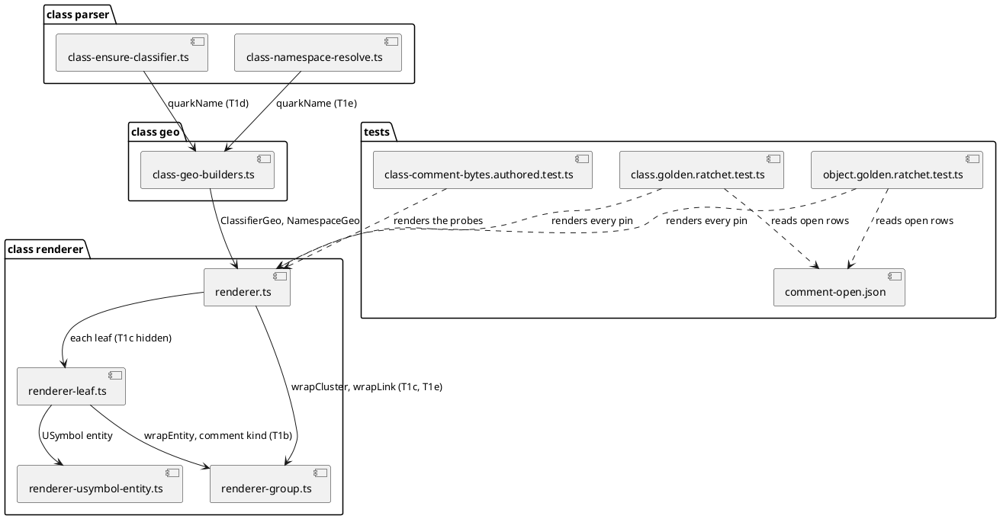

# Component map

Which modules each task touches, and what reads what. Dashed arrows are test-only.

```plantuml
@startuml
package "class parser" {
  [class-ensure-classifier.ts] as ens
  [class-namespace-resolve.ts] as nsr
}
package "class geo" {
  [class-geo-builders.ts] as geo
}
package "class renderer" {
  [renderer.ts] as rend
  [renderer-leaf.ts] as leaf
  [renderer-group.ts] as grp
  [renderer-usymbol-entity.ts] as usym
}
package "tests" {
  [class.golden.ratchet.test.ts] as rc
  [object.golden.ratchet.test.ts] as ro
  [class-comment-bytes.authored.test.ts] as gate
  [comment-open.json] as open
}
ens --> geo : quarkName (T1d)
nsr --> geo : quarkName (T1e)
geo --> rend : ClassifierGeo, NamespaceGeo
rend --> leaf : each leaf (T1c hidden)
leaf --> grp : wrapEntity, comment kind (T1b)
leaf --> usym : USymbol entity
rend --> grp : wrapCluster, wrapLink (T1c, T1e)
rc ..> rend : renders every pin
ro ..> rend : renders every pin
gate ..> rend : renders the probes
rc ..> open : reads open rows
ro ..> open : reads open rows
@enduml
```
