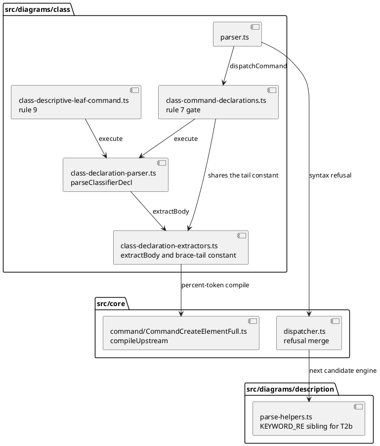

# Component map: what T2 touches

```plantuml
@startuml
package "src/diagrams/class" {
  [parser.ts] as P
  [class-command-declarations.ts\nrule 7 gate] as G
  [class-declaration-parser.ts\nparseClassifierDecl] as D
  [class-declaration-extractors.ts\nextractBody and brace-tail constant] as X
  [class-descriptive-leaf-command.ts\nrule 9] as R9
}
package "src/core" {
  [command/CommandCreateElementFull.ts\ncompileUpstream] as C
  [dispatcher.ts\nrefusal merge] as M
}
package "src/diagrams/description" {
  [parse-helpers.ts\nKEYWORD_RE sibling for T2b] as K
}
P --> G : dispatchCommand
G --> D : execute
R9 --> D : execute
D --> X : extractBody
G --> X : shares the tail constant
X --> C : percent-token compile
P --> M : syntax refusal
M --> K : next candidate engine
@enduml
```
