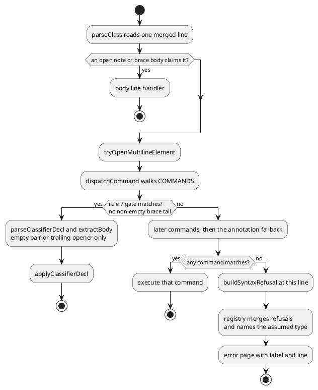

# Data flow: one classifier line through the class parser (after T2)

```plantuml
@startuml
start
:parseClass reads one merged line;
if (an open note or brace body claims it?) then (yes)
  :body line handler;
  stop
endif
:tryOpenMultilineElement;
:dispatchCommand walks COMMANDS;
if (rule 7 gate matches?\nno non-empty brace tail) then (yes)
  :parseClassifierDecl and extractBody\nempty pair or trailing opener only;
  :applyClassifierDecl;
  stop
else (no)
  :later commands, then the annotation fallback;
  if (any command matches?) then (yes)
    :execute that command;
    stop
  else (no)
    :buildSyntaxRefusal at this line;
    :registry merges refusals\nand names the assumed type;
    :error page with label and line;
    stop
  endif
endif
@enduml
```
