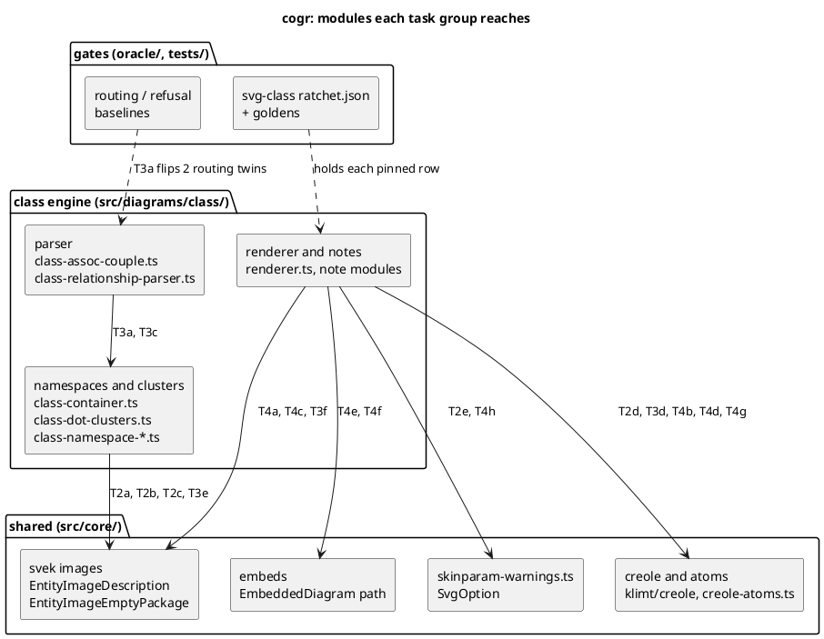

# Component map: what the tasks touch

```plantuml
@startuml
title cogr: modules each task group reaches
skinparam componentStyle rectangle

package "class engine (src/diagrams/class/)" {
  component "parser\nclass-assoc-couple.ts\nclass-relationship-parser.ts" as PARSE
  component "namespaces and clusters\nclass-container.ts\nclass-dot-clusters.ts\nclass-namespace-*.ts" as CLUSTER
  component "renderer and notes\nrenderer.ts, note modules" as RENDER
}

package "shared (src/core/)" {
  component "svek images\nEntityImageDescription\nEntityImageEmptyPackage" as SVEK
  component "creole and atoms\nklimt/creole, creole-atoms.ts" as CREOLE
  component "embeds\nEmbeddedDiagram path" as EMBED
  component "skinparam-warnings.ts\nSvgOption" as CHROME
}

package "gates (oracle/, tests/)" {
  component "svg-class ratchet.json\n+ goldens" as RATCHET
  component "routing / refusal\nbaselines" as BASE
}

PARSE --> CLUSTER : T3a, T3c
CLUSTER --> SVEK : T2a, T2b, T2c, T3e
RENDER --> CREOLE : T2d, T3d, T4b, T4d, T4g
RENDER --> SVEK : T4a, T4c, T3f
RENDER --> EMBED : T4e, T4f
RENDER --> CHROME : T2e, T4h
RATCHET ..> RENDER : holds each pinned row
BASE ..> PARSE : T3a flips 2 routing twins
@enduml
```

Description and state draw through the shared modules too, so the every-engine survey guards them.
