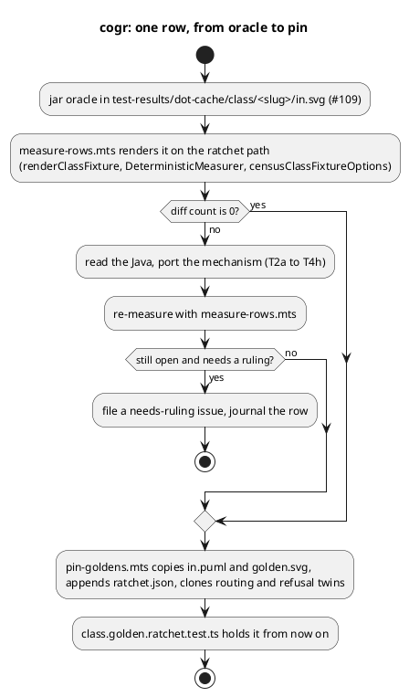

# Data flow: how a #109 class row becomes a held pin

```plantuml
@startuml
title cogr: one row, from oracle to pin
start
:jar oracle in test-results/dot-cache/class/<slug>/in.svg (#109);
:measure-rows.mts renders it on the ratchet path\n(renderClassFixture, DeterministicMeasurer, censusClassFixtureOptions);
if (diff count is 0?) then (yes)
else (no)
  :read the Java, port the mechanism (T2a to T4h);
  :re-measure with measure-rows.mts;
  if (still open and needs a ruling?) then (yes)
    :file a needs-ruling issue, journal the row;
    stop
  else (no)
  endif
endif
:pin-goldens.mts copies in.puml and golden.svg,\nappends ratchet.json, clones routing and refusal twins;
:class.golden.ratchet.test.ts holds it from now on;
stop
@enduml
```
