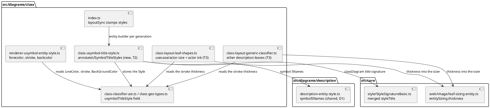

# Component map: what T2 and T3 touch

```plantuml
@startuml
package "src/diagrams/class" {
  [index.ts\nlayoutSync stamps styles] as IDX
  [class-usymbol-title-style.ts\nannotateUSymbolTitleStyles (new, T2)] as ANN
  [class-classifier-ast.ts / class-geo-types.ts\nusymbolTitleStyle field] as AST
  [renderer-usymbol-entity-style.ts\nforecolor, stroke, backcolor] as RES
  [class-layout-leaf-shapes.ts\nusecase/actor size + actor ink (T3)] as LS
  [class-layout-generic-classifier.ts\nother description leaves (T3)] as GC
}
package "src/diagrams/description" {
  [description-entity-style.ts\nsymbolSNames (shared, D1)] as DES
}
package "src/core" {
  [style/StyleSignatureBasic.ts\nmerged styleTitle] as SIG
  [svek/image/leaf-sizing-entity.ts\nentitySizing.thickness] as LSE
}
IDX --> ANN : entity builder per generation
ANN --> DES : symbol SNames
ANN --> SIG : classDiagram title signature
ANN --> AST : stores the Style
RES --> AST : reads LineColor, stroke, BackGroundColor
LS --> AST : reads the stroke thickness
GC --> AST : reads the stroke thickness
LS --> LSE : thickness into the sizer
GC --> LSE : thickness into the sizer
@enduml
```
