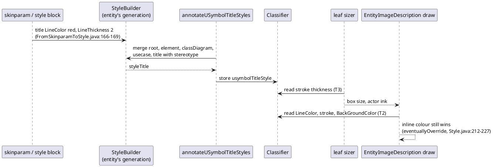

# Data flow: one mixed-in usecase under `skinparam titleBorderColor red`

```plantuml
@startuml
participant "skinparam / style block" as SK
participant "StyleBuilder\n(entity's generation)" as SB
participant "annotateUSymbolTitleStyles" as ANN
participant "Classifier" as C
participant "leaf sizer" as SZ
participant "EntityImageDescription draw" as DR
SK -> SB : title LineColor red, LineThickness 2\n(FromSkinparamToStyle.java:166-169)
ANN -> SB : merge root, element, classDiagram,\nusecase, title with stereotype
SB --> ANN : styleTitle
ANN -> C : store usymbolTitleStyle
SZ -> C : read stroke thickness (T3)
SZ --> DR : box size, actor ink
DR -> C : read LineColor, stroke, BackGroundColor (T2)
DR --> DR : inline colour still wins\n(eventuallyOverride, Style.java:212-227)
@enduml
```
