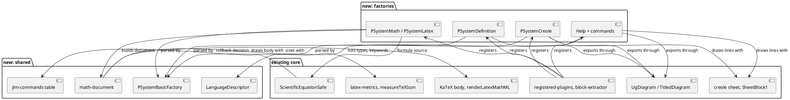

# Component map

What this mission adds (the five factories, three shared pieces) and the existing modules they lean on.

```plantuml
@startuml
package "new: factories" {
  [PSystemCreole] as C
  [PSystemDefinition] as D
  [PSystemMath / PSystemLatex] as M
  [Help + commands] as H
}
package "new: shared" {
  [PSystemBasicFactory] as BF
  [math-document] as MD
  [LanguageDescriptor] as LD
  [jlm-commands table] as JC
}
package "existing core" {
  [UgDiagram / TitledDiagram] as UG
  [creole sheet, SheetBlock1] as CR
  [ScientificEquationSafe] as SES
  [latex-metrics, measureTeXIcon] as LM
  [KaTeX body, renderLatexMathML] as KT
  [registered-plugins, block-extractor] as RP
}
C --> BF : parsed by
D --> BF : parsed by
M --> BF : parsed by
C --> UG : exports through
D --> UG : exports through
H --> UG : exports through
C --> CR : draws lines with
H --> CR : draws lines with
H --> LD : lists types, keywords
M --> MD : builds document
MD --> LM : sizes with
MD --> KT : draws body with
M --> SES : formula source
SES --> JC : rollback decision
RP --> C : registers
RP --> D : registers
RP --> M : registers
RP --> H : registers
@enduml
```
