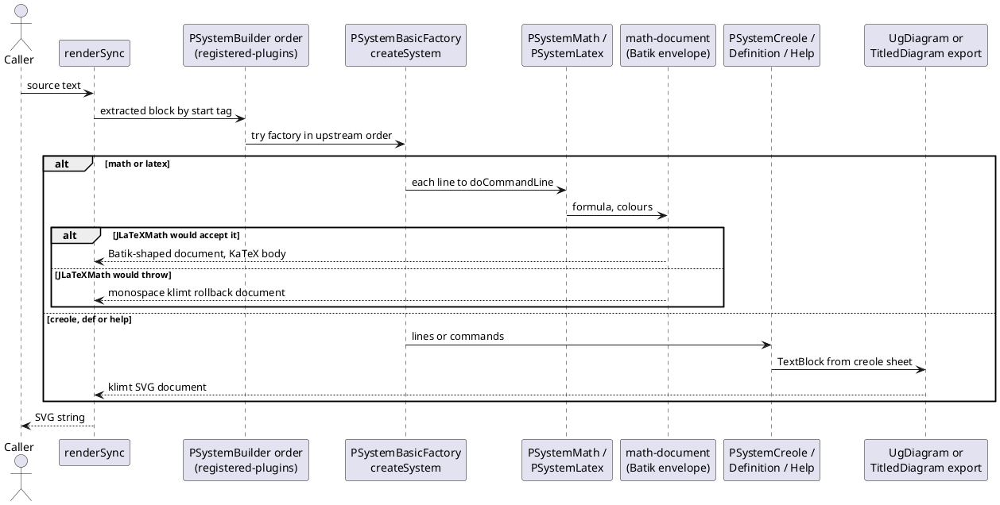

# Data flow

How one source reaches the jar-shaped output. Math and latex skip klimt; the other three end in a `UgDiagram` export.

```plantuml
@startuml
actor Caller
participant "renderSync" as R
participant "PSystemBuilder order\n(registered-plugins)" as B
participant "PSystemBasicFactory\ncreateSystem" as F
participant "PSystemMath /\nPSystemLatex" as M
participant "math-document\n(Batik envelope)" as D
participant "PSystemCreole /\nDefinition / Help" as U
participant "UgDiagram or\nTitledDiagram export" as X

Caller -> R : source text
R -> B : extracted block by start tag
B -> F : try factory in upstream order
alt math or latex
  F -> M : each line to doCommandLine
  M -> D : formula, colours
  alt JLaTeXMath would accept it
    D --> R : Batik-shaped document, KaTeX body
  else JLaTeXMath would throw
    D --> R : monospace klimt rollback document
  end
else creole, def or help
  F -> U : lines or commands
  U -> X : TextBlock from creole sheet
  X --> R : klimt SVG document
end
R --> Caller : SVG string
@enduml
```
