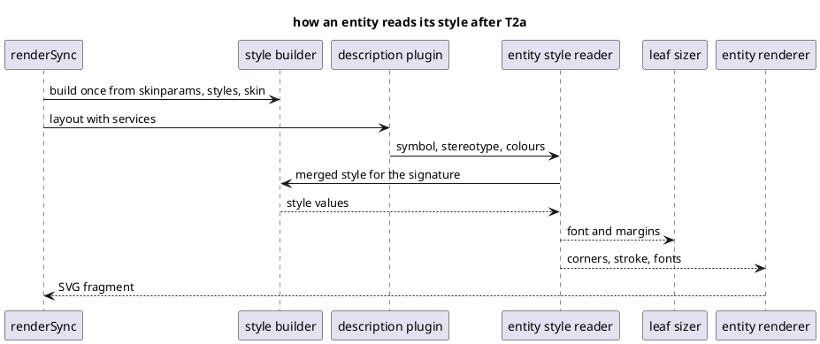

# Data flow — one entity's style, after T2a (proposed)

```plantuml
@startuml
title how an entity reads its style after T2a
participant "renderSync" as RS
participant "style builder" as SB
participant "description plugin" as DP
participant "entity style reader" as ES
participant "leaf sizer" as LS
participant "entity renderer" as ER
RS -> SB : build once from skinparams, styles, skin
RS -> DP : layout with services
DP -> ES : symbol, stereotype, colours
ES -> SB : merged style for the signature
SB --> ES : style values
ES --> LS : font and margins
ES --> ER : corners, stroke, fonts
ER --> RS : SVG fragment
@enduml
```
