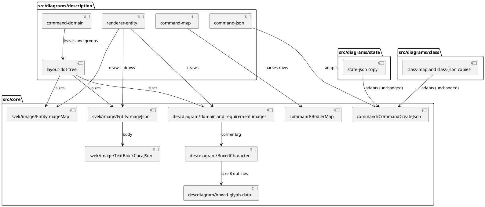

# Component map

New modules (D1) and who consumes them. Class and state keep their own json and map copies.

```plantuml
@startuml
skinparam monochrome true
package "src/core" {
  [command/CommandCreateJson] as CCJ
  [command/BodierMap] as BM
  [svek/image/EntityImageJson] as EIJ
  [svek/image/TextBlockCucaJSon] as TBJ
  [svek/image/EntityImageMap] as EIM
  [descdiagram/BoxedCharacter] as BC
  [descdiagram/boxed-glyph-data] as BGD
  [descdiagram/domain and requirement images] as DOM
}
package "src/diagrams/description" {
  [command-json] as CJ
  [command-map] as CM
  [command-domain] as CD
  [layout-dot-tree] as LDT
  [renderer-entity] as RE
}
package "src/diagrams/state" {
  [state-json copy] as SJ
}
package "src/diagrams/class" {
  [class-map and class-json copies] as CMJ
}
CJ --> CCJ : adapts
SJ --> CCJ : adapts (unchanged)
CMJ --> CCJ : adapts (unchanged)
CM --> BM : parses rows
EIJ --> TBJ : body
DOM --> BC : corner tag
BC --> BGD : size-8 outlines
LDT --> EIJ : sizes
LDT --> EIM : sizes
LDT --> DOM : sizes
RE --> EIJ : draws
RE --> EIM : draws
RE --> DOM : draws
CD --> LDT : leaves and groups
@enduml
```
