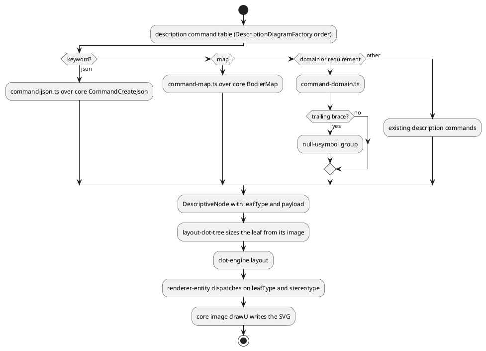

# Data flow

How a `json`, `map`, `domain` or `requirement` line reaches the SVG after this mission.

```plantuml
@startuml
skinparam monochrome true
start
:description command table (DescriptionDiagramFactory order);
if (keyword?) then (json)
  :command-json.ts over core CommandCreateJson;
elseif (map)
  :command-map.ts over core BodierMap;
elseif (domain or requirement)
  :command-domain.ts;
  if (trailing brace?) then (yes)
    :null-usymbol group;
  else (no)
  endif
else (other)
  :existing description commands;
endif
:DescriptiveNode with leafType and payload;
:layout-dot-tree sizes the leaf from its image;
:dot-engine layout;
:renderer-entity dispatches on leafType and stereotype;
:core image drawU writes the SVG;
stop
@enduml
```
