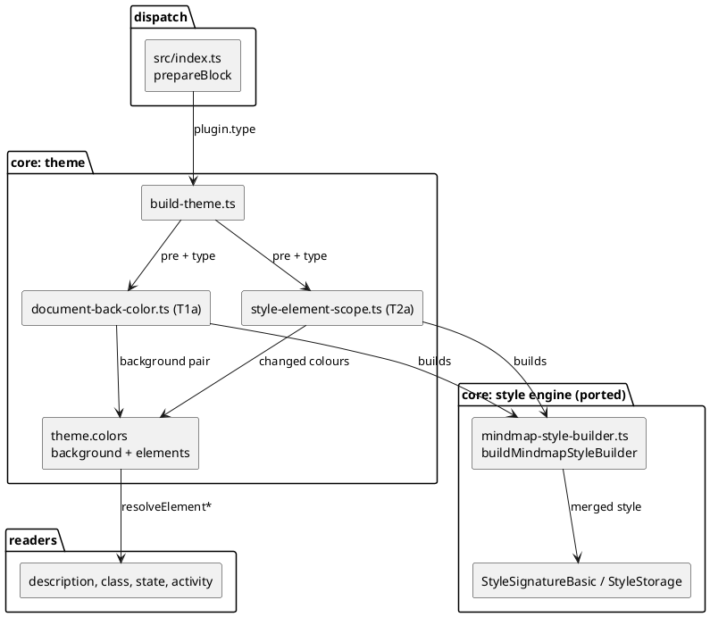

# Component map — diagram style scope

Proposed state. T1a and T2a are the two new edges out of the builder.

```plantuml
@startuml
skinparam componentStyle rectangle
package "dispatch" {
  [src/index.ts\nprepareBlock] as IDX
}
package "core: style engine (ported)" {
  [mindmap-style-builder.ts\nbuildMindmapStyleBuilder] as SB
  [StyleSignatureBasic / StyleStorage] as SS
}
package "core: theme" {
  [build-theme.ts] as BT
  [document-back-color.ts (T1a)] as DBC
  [style-element-scope.ts (T2a)] as SES
  [theme.colors\nbackground + elements] as TC
}
package "readers" {
  [description, class, state, activity] as R
}
IDX --> BT : plugin.type
BT --> DBC : pre + type
BT --> SES : pre + type
DBC --> SB : builds
SES --> SB : builds
SB --> SS : merged style
DBC --> TC : background pair
SES --> TC : changed colours
TC --> R : resolveElement*
@enduml
```
