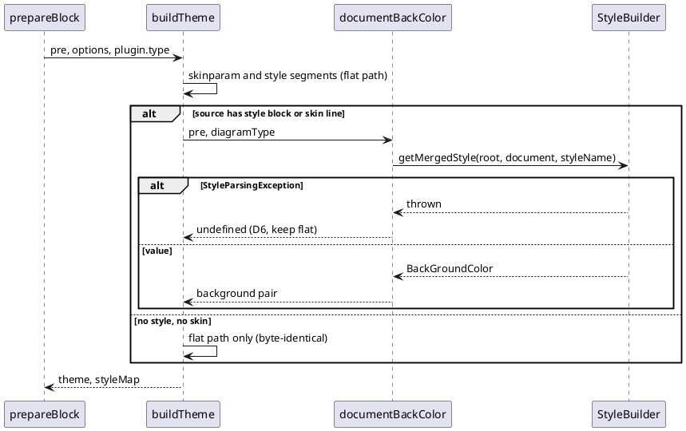

# Data flow — one document background

```plantuml
@startuml
participant "prepareBlock" as P
participant "buildTheme" as B
participant "documentBackColor" as D
participant "StyleBuilder" as S
P -> B : pre, options, plugin.type
B -> B : skinparam and style segments (flat path)
alt source has style block or skin line
  B -> D : pre, diagramType
  D -> S : getMergedStyle(root, document, styleName)
  alt StyleParsingException
    S --> D : thrown
    D --> B : undefined (D6, keep flat)
  else value
    S --> D : BackGroundColor
    D --> B : background pair
  end
else no style, no skin
  B -> B : flat path only (byte-identical)
end
B --> P : theme, styleMap
@enduml
```
