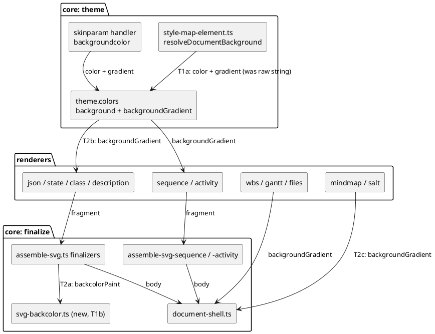

# Component map — document background paint

Current state is the defect; the proposed state adds the marked edges.

```plantuml
@startuml
skinparam componentStyle rectangle
package "core: theme" {
  [style-map-element.ts\nresolveDocumentBackground] as SME
  [skinparam handler\nbackgroundcolor] as SKH
  [theme.colors\nbackground + backgroundGradient] as TC
}
package "renderers" {
  [sequence / activity] as SA
  [json / state / class / description] as JSCD
  [mindmap / salt] as MS
  [wbs / gantt / files] as WGF
}
package "core: finalize" {
  [svg-backcolor.ts (new, T1b)] as SB
  [assemble-svg.ts finalizers] as AS
  [assemble-svg-sequence / -activity] as ASA
  [document-shell.ts] as DS
}
SKH --> TC : color + gradient
SME --> TC : T1a: color + gradient (was raw string)
TC --> SA : backgroundGradient
TC --> JSCD : T2b: backgroundGradient
SA --> ASA : fragment
JSCD --> AS : fragment
AS --> SB : T2a: backcolorPaint
MS --> DS : T2c: backgroundGradient
WGF --> DS : backgroundGradient
ASA --> DS : body
AS --> DS : body
@enduml
```
