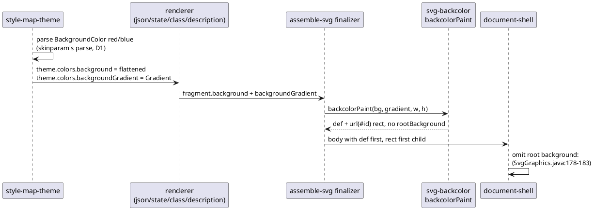

# Data flow — a `<style>` document gradient, after the fix

```plantuml
@startuml
participant "style-map-theme" as ST
participant "renderer\n(json/state/class/description)" as R
participant "assemble-svg finalizer" as F
participant "svg-backcolor\nbackcolorPaint" as B
participant "document-shell" as S
ST -> ST : parse BackgroundColor red/blue\n(skinparam's parse, D1)
ST -> R : theme.colors.background = flattened\ntheme.colors.backgroundGradient = Gradient
R -> F : fragment.background + backgroundGradient
F -> B : backcolorPaint(bg, gradient, w, h)
B --> F : def + url(#id) rect, no rootBackground
F -> S : body with def first, rect first child
S -> S : omit root background:\n(SvgGraphics.java:178-183)
@enduml
```
