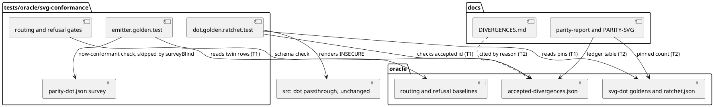

# Component map: what the mission touches

T1 writes the goldens, the ratchet, the ledger and the twins. T2 writes the docs. Nothing under `src/` changes.

```plantuml
@startuml
package "oracle" {
  [svg-dot goldens and ratchet.json] as GOLD
  [accepted-divergences.json] as LEDGER
  [routing and refusal baselines] as BASE
}
package "tests/oracle/svg-conformance" {
  [dot.golden.ratchet.test] as RATCHET
  [emitter.golden.test] as EMIT
  [routing and refusal gates] as GATES
  [parity-dot.json survey] as SURVEY
}
package "docs" {
  [DIVERGENCES.md] as DIV
  [parity-report and PARITY-SVG] as DASH
}
[src: dot passthrough, unchanged] as SRC
RATCHET --> GOLD : reads pins (T1)
RATCHET --> LEDGER : checks accepted id (T1)
RATCHET --> SRC : renders INSECURE
EMIT --> LEDGER : schema check
EMIT --> SURVEY : now-conformant check, skipped by surveyBlind
GATES --> BASE : reads twin rows (T1)
DASH --> GOLD : pinned count (T2)
DASH --> LEDGER : ledger table (T2)
DIV ..> LEDGER : cited by reason (T2)
@enduml
```
