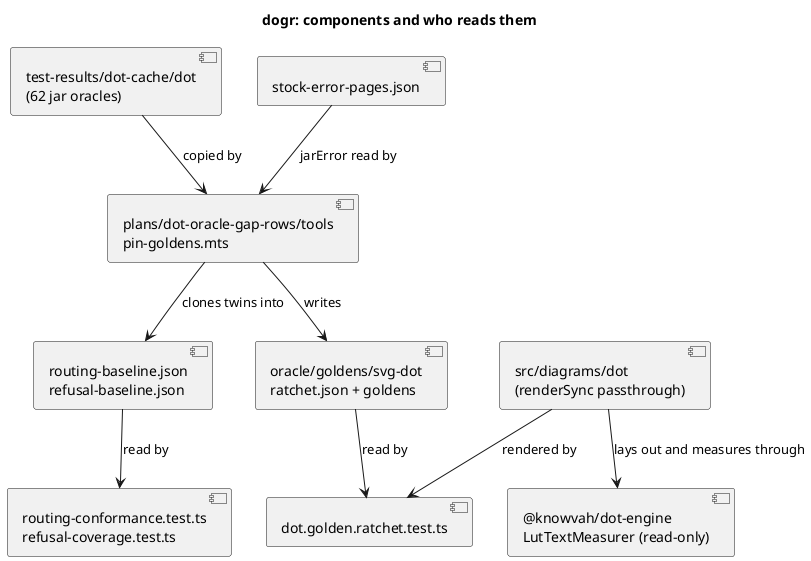

# Component map: what dogr touches

```plantuml
@startuml
title dogr: components and who reads them
component "test-results/dot-cache/dot\n(62 jar oracles)" as cache
component "plans/dot-oracle-gap-rows/tools\npin-goldens.mts" as pin
component "oracle/goldens/svg-dot\nratchet.json + goldens" as goldens
component "routing-baseline.json\nrefusal-baseline.json" as twins
component "stock-error-pages.json" as stock
component "dot.golden.ratchet.test.ts" as ratchet
component "routing-conformance.test.ts\nrefusal-coverage.test.ts" as gates
component "src/diagrams/dot\n(renderSync passthrough)" as dotsrc
component "@knowvah/dot-engine\nLutTextMeasurer (read-only)" as engine

cache --> pin : copied by
stock --> pin : jarError read by
pin --> goldens : writes
pin --> twins : clones twins into
goldens --> ratchet : read by
twins --> gates : read by
dotsrc --> ratchet : rendered by
dotsrc --> engine : lays out and measures through
@enduml
```
