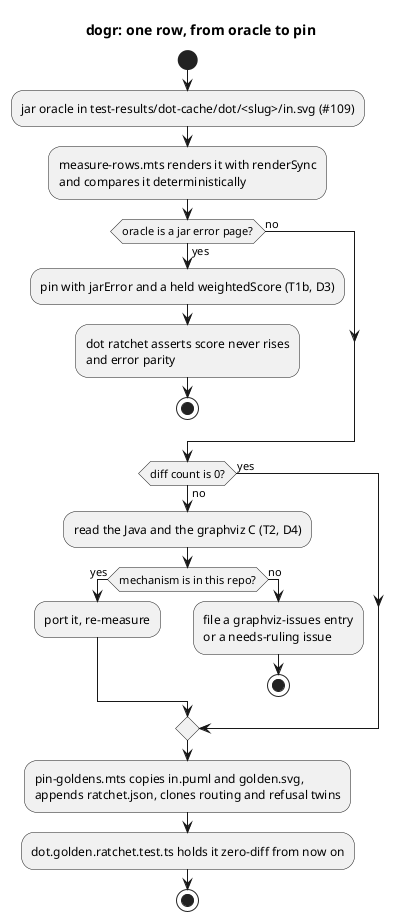

# Data flow: how a #109 dot row becomes a held pin

```plantuml
@startuml
title dogr: one row, from oracle to pin
start
:jar oracle in test-results/dot-cache/dot/<slug>/in.svg (#109);
:measure-rows.mts renders it with renderSync\nand compares it deterministically;
if (oracle is a jar error page?) then (yes)
  :pin with jarError and a held weightedScore (T1b, D3);
  :dot ratchet asserts score never rises\nand error parity;
  stop
else (no)
endif
if (diff count is 0?) then (yes)
else (no)
  :read the Java and the graphviz C (T2, D4);
  if (mechanism is in this repo?) then (yes)
    :port it, re-measure;
  else (no)
    :file a graphviz-issues entry\nor a needs-ruling issue;
    stop
  endif
endif
:pin-goldens.mts copies in.puml and golden.svg,\nappends ratchet.json, clones routing and refusal twins;
:dot.golden.ratchet.test.ts holds it zero-diff from now on;
stop
@enduml
```
