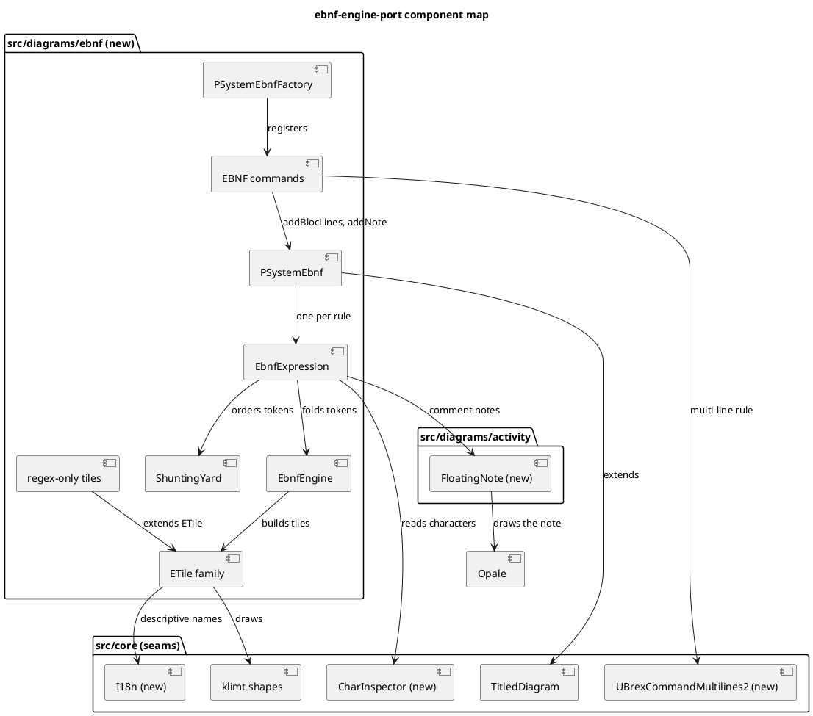

# Component map

The modules this mission adds, and the existing ones they lean on (D1, D3).

```plantuml
@startuml
title ebnf-engine-port component map
package "src/diagrams/ebnf (new)" {
  [PSystemEbnfFactory] as F
  [EBNF commands] as C
  [PSystemEbnf] as D
  [EbnfExpression] as E
  [ShuntingYard] as S
  [EbnfEngine] as G
  [ETile family] as T
  [regex-only tiles] as R
}
package "src/core (seams)" {
  [UBrexCommandMultilines2 (new)] as U
  [CharInspector (new)] as I
  [I18n (new)] as N
  [TitledDiagram] as TD
  [klimt shapes] as K
}
package "src/diagrams/activity" {
  [FloatingNote (new)] as FN
}
[Opale] as O
F --> C : registers
C --> U : multi-line rule
C --> D : addBlocLines, addNote
D --> TD : extends
D --> E : one per rule
E --> I : reads characters
E --> S : orders tokens
E --> G : folds tokens
G --> T : builds tiles
T --> N : descriptive names
T --> K : draws
E --> FN : comment notes
FN --> O : draws the note
R --> T : extends ETile
@enduml
```
