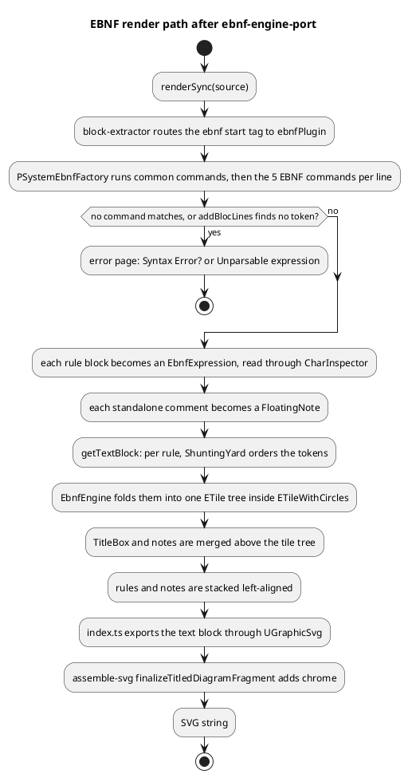

# Data flow

How an EBNF source becomes SVG after the port (D1, D2).

```plantuml
@startuml
title EBNF render path after ebnf-engine-port
start
:renderSync(source);
:block-extractor routes the ebnf start tag to ebnfPlugin;
:PSystemEbnfFactory runs common commands, then the 5 EBNF commands per line;
if (no command matches, or addBlocLines finds no token?) then (yes)
  :error page: Syntax Error? or Unparsable expression;
  stop
else (no)
endif
:each rule block becomes an EbnfExpression, read through CharInspector;
:each standalone comment becomes a FloatingNote;
:getTextBlock: per rule, ShuntingYard orders the tokens;
:EbnfEngine folds them into one ETile tree inside ETileWithCircles;
:TitleBox and notes are merged above the tile tree;
:rules and notes are stacked left-aligned;
:index.ts exports the text block through UGraphicSvg;
:assemble-svg finalizeTitledDiagramFragment adds chrome;
:SVG string;
stop
@enduml
```
