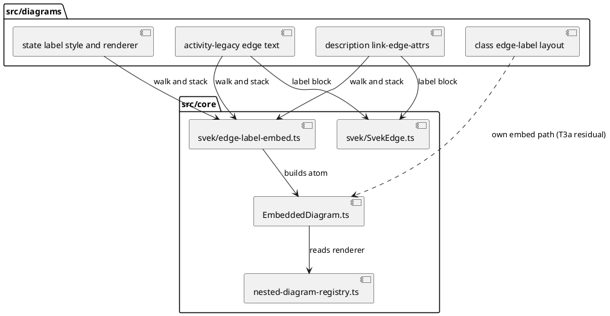

# Component map (ele)

What this mission touches. Diagrams import core only (layering rule 2), so the walk lives in core (D3).

```plantuml
@startuml
package "src/core" {
  [svek/edge-label-embed.ts] as H
  [EmbeddedDiagram.ts] as ED
  [nested-diagram-registry.ts] as REG
  [svek/SvekEdge.ts] as SE
}
package "src/diagrams" {
  [state label style and renderer] as ST
  [description link-edge-attrs] as DE
  [activity-legacy edge text] as AL
  [class edge-label layout] as CL
}
H --> ED : builds atom
ED --> REG : reads renderer
ST --> H : walk and stack
DE --> H : walk and stack
AL --> H : walk and stack
DE --> SE : label block
AL --> SE : label block
CL ..> ED : own embed path (T3a residual)
@enduml
```
