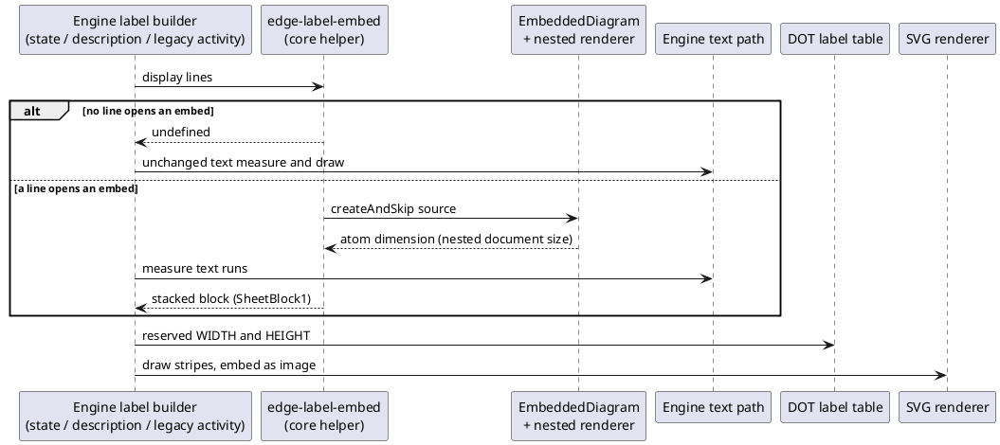

# Data flow: an edge label with an embed (ele)

Proposed flow after batches 1 and 2. A label with no embed line takes the unchanged arm (D2).

```plantuml
@startuml
participant "Engine label builder\n(state / description / legacy activity)" as E
participant "edge-label-embed\n(core helper)" as H
participant "EmbeddedDiagram\n+ nested renderer" as N
participant "Engine text path" as T
participant "DOT label table" as D
participant "SVG renderer" as R
E -> H : display lines
alt no line opens an embed
  H --> E : undefined
  E -> T : unchanged text measure and draw
else a line opens an embed
  H -> N : createAndSkip source
  N --> H : atom dimension (nested document size)
  E -> T : measure text runs
  H --> E : stacked block (SheetBlock1)
end
E -> D : reserved WIDTH and HEIGHT
E -> R : draw stripes, embed as image
@enduml
```
