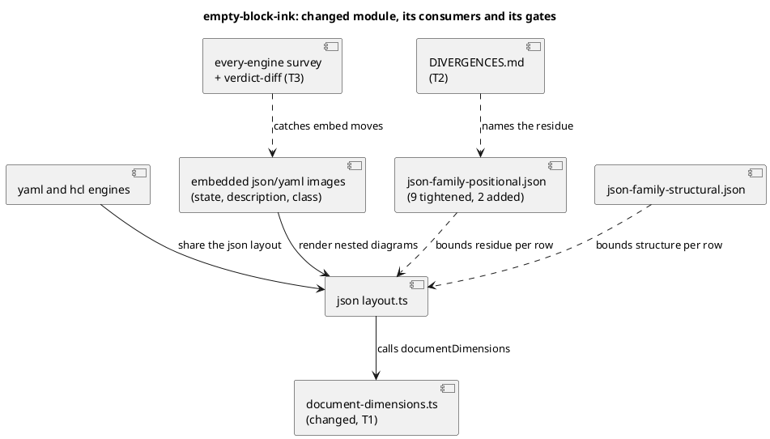

# Component map

What T1 changes, what reads it, and the gates that hold it.

```plantuml
@startuml
title empty-block-ink: changed module, its consumers and its gates
component "document-dimensions.ts\n(changed, T1)" as DD
component "json layout.ts" as LAY
component "yaml and hcl engines" as YH
component "embedded json/yaml images\n(state, description, class)" as EMB
component "json-family-positional.json\n(9 tightened, 2 added)" as PIN
component "json-family-structural.json" as STR
component "every-engine survey\n+ verdict-diff (T3)" as SUR
component "DIVERGENCES.md\n(T2)" as DIV

LAY --> DD : calls documentDimensions
YH --> LAY : share the json layout
EMB --> LAY : render nested diagrams
PIN ..> LAY : bounds residue per row
STR ..> LAY : bounds structure per row
SUR ..> EMB : catches embed moves
DIV ..> PIN : names the residue
@enduml
```
