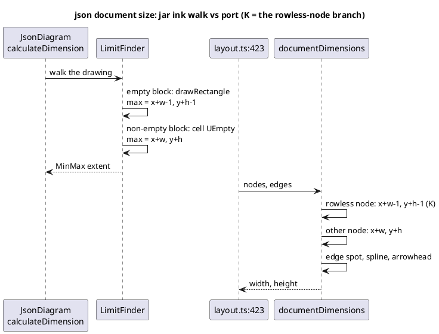

# Data flow: where the document size comes from

The jar's chain on the left, ours on the right. K changes only the rowless-node branch in `documentDimensions`.

```plantuml
@startuml
title json document size: jar ink walk vs port (K = the rowless-node branch)
participant "JsonDiagram\ncalculateDimension" as JD
participant "LimitFinder" as LF
participant "layout.ts:423" as LAY
participant "documentDimensions" as DD

JD -> LF : walk the drawing
LF -> LF : empty block: drawRectangle\nmax = x+w-1, y+h-1
LF -> LF : non-empty block: cell UEmpty\nmax = x+w, y+h
LF --> JD : MinMax extent

LAY -> DD : nodes, edges
DD -> DD : rowless node: x+w-1, y+h-1 (K)
DD -> DD : other node: x+w, y+h
DD -> DD : edge spot, spline, arrowhead
DD --> LAY : width, height
@enduml
```
