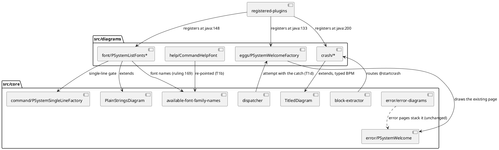

# Component map

The components this mission creates or touches. Path is absent: D5 ports nothing for it.

```plantuml
@startuml
package "src/diagrams" {
  [eggs/PSystemWelcomeFactory] as WF
  [font/PSystemListFonts*] as LF
  [crash/*] as CR
  [help/CommandHelpFont] as HF
}
package "src/core" {
  [error/PSystemWelcome] as PW
  [error/error-diagrams] as ED
  [available-font-family-names] as AF
  [PlainStringsDiagram] as PS
  [command/PSystemSingleLineFactory] as SL
  [dispatcher] as DI
  [block-extractor] as BE
  [TitledDiagram] as TD
}
[registered-plugins] as RP

RP --> WF : registers at java:133
RP --> LF : registers at java:148
RP --> CR : registers at java:200
WF --> PW : draws the existing page
ED ..> PW : error pages stack it (unchanged)
LF --> SL : single-line gate
LF --> PS : extends
LF --> AF : font names (ruling 169)
HF --> AF : re-pointed (T1b)
CR --> TD : extends, typed BPM
BE --> CR : routes @startcrash
DI --> WF : attempt with the catch (T1d)
@enduml
```
