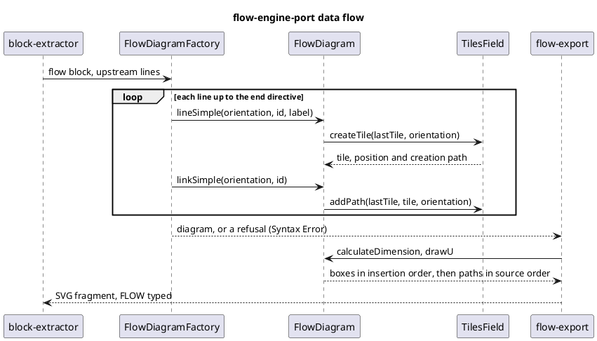

# Data flow — one `@startflow` source to SVG

```plantuml
@startuml
title flow-engine-port data flow
participant "block-extractor" as BE
participant "FlowDiagramFactory" as F
participant "FlowDiagram" as D
participant "TilesField" as T
participant "flow-export" as X
BE -> F : flow block, upstream lines
loop each line up to the end directive
  F -> D : lineSimple(orientation, id, label)
  D -> T : createTile(lastTile, orientation)
  T --> D : tile, position and creation path
  F -> D : linkSimple(orientation, id)
  D -> T : addPath(lastTile, tile, orientation)
end
F --> X : diagram, or a refusal (Syntax Error)
X -> D : calculateDimension, drawU
D --> X : boxes in insertion order, then paths in source order
X --> BE : SVG fragment, FLOW typed
@enduml
```
