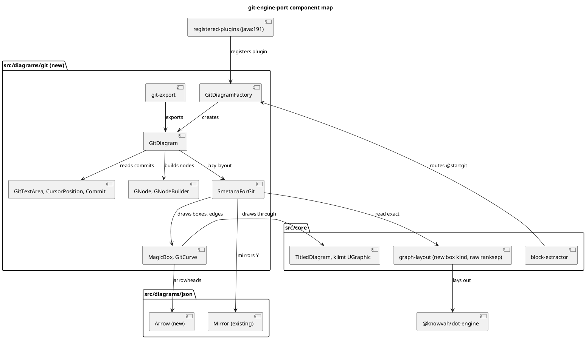

# Component map — what this mission adds and touches

```plantuml
@startuml
title git-engine-port component map
package "src/diagrams/git (new)" {
  [GitDiagramFactory] as Fac
  [GitDiagram] as Diag
  [GitTextArea, CursorPosition, Commit] as Grid
  [GNode, GNodeBuilder] as Nodes
  [SmetanaForGit] as Lay
  [MagicBox, GitCurve] as Draw
  [git-export] as Exp
}
package "src/diagrams/json" {
  [Mirror (existing)] as Mir
  [Arrow (new)] as Arr
}
package "src/core" {
  [graph-layout (new box kind, raw ranksep)] as GL
  [TitledDiagram, klimt UGraphic] as Klimt
  [block-extractor] as BE
}
[registered-plugins (java:191)] as Reg
[@knowvah/dot-engine] as DE
Fac --> Diag : creates
Diag --> Grid : reads commits
Diag --> Nodes : builds nodes
Diag --> Lay : lazy layout
Lay --> GL : read exact
GL --> DE : lays out
Lay --> Mir : mirrors Y
Lay --> Draw : draws boxes, edges
Draw --> Arr : arrowheads
Draw --> Klimt : draws through
Exp --> Diag : exports
Reg --> Fac : registers plugin
BE --> Fac : routes @startgit
@enduml
```
