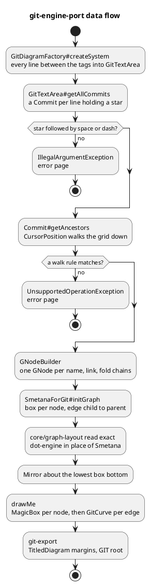

# Data flow — one `@startgit` source to SVG

```plantuml
@startuml
title git-engine-port data flow
start
:GitDiagramFactory#createSystem
every line between the tags into GitTextArea;
:GitTextArea#getAllCommits
a Commit per line holding a star;
if (star followed by space or dash?) then (no)
  :IllegalArgumentException
error page;
  stop
endif
:Commit#getAncestors
CursorPosition walks the grid down;
if (a walk rule matches?) then (no)
  :UnsupportedOperationException
error page;
  stop
endif
:GNodeBuilder
one GNode per name, link, fold chains;
:SmetanaForGit#initGraph
box per node, edge child to parent;
:core/graph-layout read exact
dot-engine in place of Smetana;
:Mirror about the lowest box bottom;
:drawMe
MagicBox per node, then GitCurve per edge;
:git-export
TitledDiagram margins, GIT root;
stop
@enduml
```
