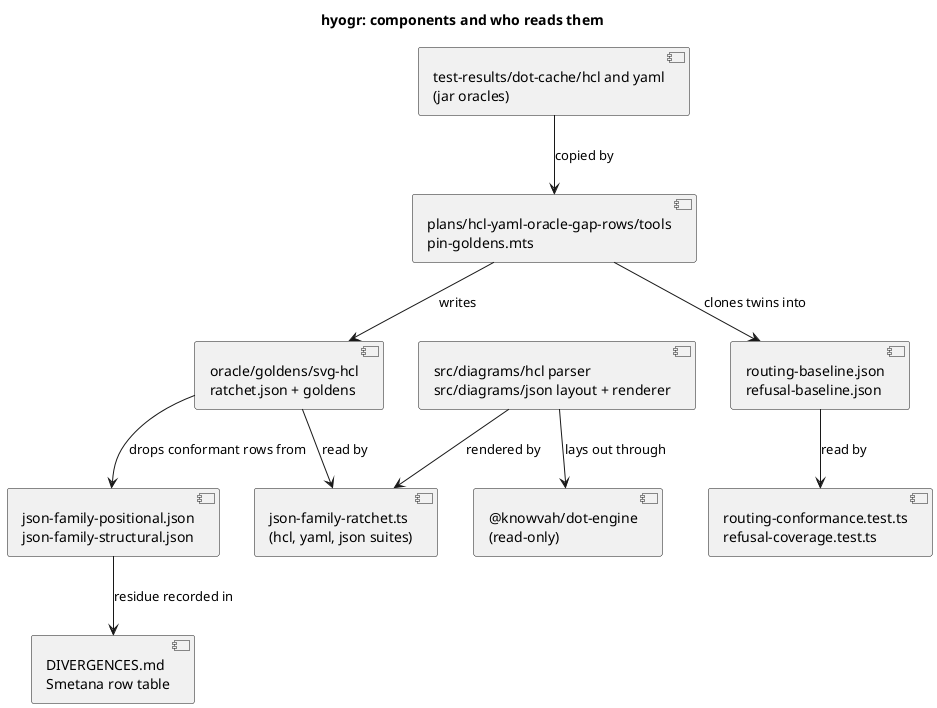

# Component map: what hyogr touches

```plantuml
@startuml
title hyogr: components and who reads them
component "test-results/dot-cache/hcl and yaml\n(jar oracles)" as cache
component "plans/hcl-yaml-oracle-gap-rows/tools\npin-goldens.mts" as pin
component "oracle/goldens/svg-hcl\nratchet.json + goldens" as goldens
component "routing-baseline.json\nrefusal-baseline.json" as twins
component "json-family-positional.json\njson-family-structural.json" as pins
component "json-family-ratchet.ts\n(hcl, yaml, json suites)" as ratchet
component "routing-conformance.test.ts\nrefusal-coverage.test.ts" as gates
component "src/diagrams/hcl parser\nsrc/diagrams/json layout + renderer" as src
component "DIVERGENCES.md\nSmetana row table" as div
component "@knowvah/dot-engine\n(read-only)" as engine

cache --> pin : copied by
pin --> goldens : writes
pin --> twins : clones twins into
goldens --> ratchet : read by
twins --> gates : read by
goldens --> pins : drops conformant rows from
src --> ratchet : rendered by
src --> engine : lays out through
pins --> div : residue recorded in
@enduml
```
