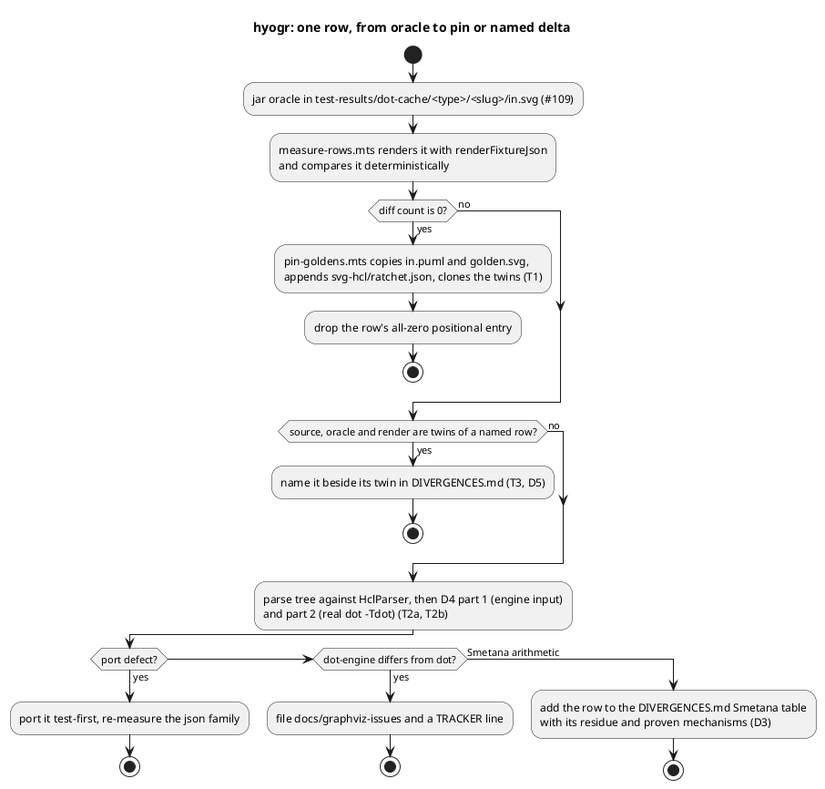

# Data flow: how a #109 hcl or yaml row is closed

```plantuml
@startuml
title hyogr: one row, from oracle to pin or named delta
start
:jar oracle in test-results/dot-cache/<type>/<slug>/in.svg (#109);
:measure-rows.mts renders it with renderFixtureJson\nand compares it deterministically;
if (diff count is 0?) then (yes)
  :pin-goldens.mts copies in.puml and golden.svg,\nappends svg-hcl/ratchet.json, clones the twins (T1);
  :drop the row's all-zero positional entry;
  stop
else (no)
endif
if (source, oracle and render are twins of a named row?) then (yes)
  :name it beside its twin in DIVERGENCES.md (T3, D5);
  stop
else (no)
endif
:parse tree against HclParser, then D4 part 1 (engine input)\nand part 2 (real dot -Tdot) (T2a, T2b);
if (port defect?) then (yes)
  :port it test-first, re-measure the json family;
  stop
elseif (dot-engine differs from dot?) then (yes)
  :file docs/graphviz-issues and a TRACKER line;
  stop
else (Smetana arithmetic)
  :add the row to the DIVERGENCES.md Smetana table\nwith its residue and proven mechanisms (D3);
  stop
endif
@enduml
```
