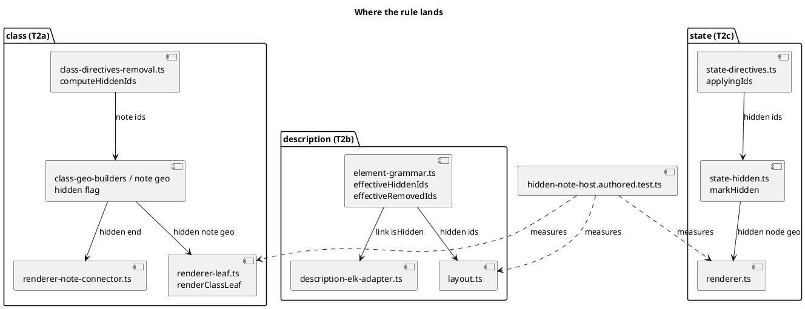

# Component map

The files each batch-2 task changes, and the gate that measures them. Rendered through the oracle jar at planning: it parses.

```plantuml
@startuml
title Where the rule lands
package "class (T2a)" {
  [class-directives-removal.ts\ncomputeHiddenIds] as CH
  [class-geo-builders / note geo\nhidden flag] as CG
  [renderer-leaf.ts\nrenderClassLeaf] as CR
  [renderer-note-connector.ts] as CC
}
package "description (T2b)" {
  [element-grammar.ts\neffectiveHiddenIds\neffectiveRemovedIds] as DE
  [layout.ts] as DL
  [description-elk-adapter.ts] as DA
}
package "state (T2c)" {
  [state-directives.ts\napplyingIds] as SD
  [state-hidden.ts\nmarkHidden] as SH
  [renderer.ts] as SR
}
[hidden-note-host.authored.test.ts] as G
CH --> CG : note ids
CG --> CR : hidden note geo
CG --> CC : hidden end
DE --> DL : hidden ids
DE --> DA : link isHidden
SD --> SH : hidden ids
SH --> SR : hidden node geo
G ..> CR : measures
G ..> DL : measures
G ..> SR : measures
@enduml
```
