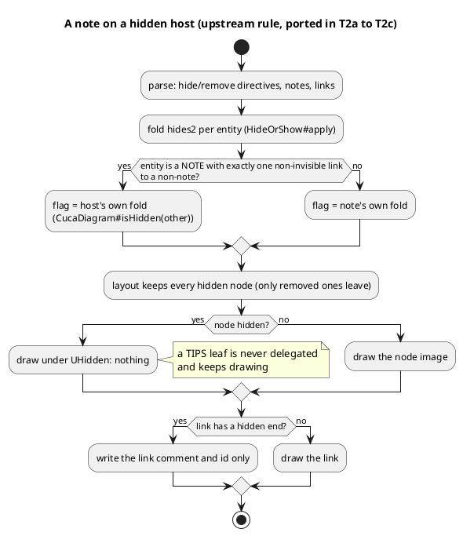

# Data flow

How upstream decides whether a note draws, and the order the port must follow. Rendered through the oracle jar at planning: it parses.

```plantuml
@startuml
title A note on a hidden host (upstream rule, ported in T2a to T2c)
start
:parse: hide/remove directives, notes, links;
:fold hides2 per entity (HideOrShow#apply);
if (entity is a NOTE with exactly one non-invisible link\nto a non-note?) then (yes)
  :flag = host's own fold\n(CucaDiagram#isHidden(other));
else (no)
  :flag = note's own fold;
endif
:layout keeps every hidden node (only removed ones leave);
if (node hidden?) then (yes)
  :draw under UHidden: nothing;
  note right: a TIPS leaf is never delegated\nand keeps drawing
else (no)
  :draw the node image;
endif
if (link has a hidden end?) then (yes)
  :write the link comment and id only;
else (no)
  :draw the link;
endif
stop
@enduml
```
