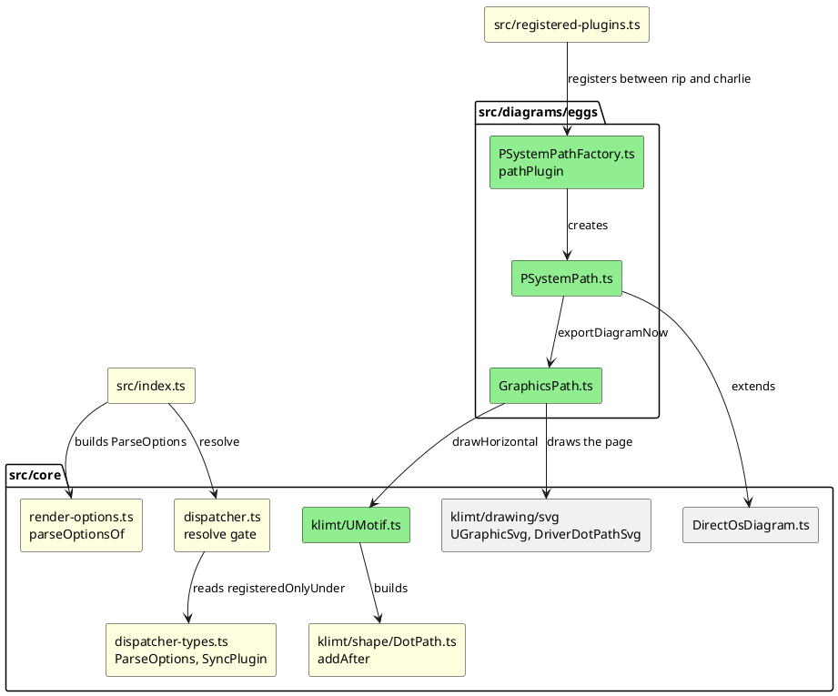

# Component map

The components this mission touches. Green components are new; yellow components change.

```plantuml
@startuml
skinparam componentStyle rectangle

package "src/core" {
  [render-options.ts\nparseOptionsOf] as RO #LightYellow
  [dispatcher-types.ts\nParseOptions, SyncPlugin] as DT #LightYellow
  [dispatcher.ts\nresolve gate] as DI #LightYellow
  [DirectOsDiagram.ts] as DO
  [klimt/UMotif.ts] as UM #LightGreen
  [klimt/shape/DotPath.ts\naddAfter] as DP #LightYellow
  [klimt/drawing/svg\nUGraphicSvg, DriverDotPathSvg] as SV
}
package "src/diagrams/eggs" {
  [PSystemPathFactory.ts\npathPlugin] as PF #LightGreen
  [PSystemPath.ts] as PP #LightGreen
  [GraphicsPath.ts] as GP #LightGreen
}
[src/index.ts] as IX #LightYellow
[src/registered-plugins.ts] as RP #LightYellow

IX --> RO : builds ParseOptions
IX --> DI : resolve
DI --> DT : reads registeredOnlyUnder
RP --> PF : registers between rip and charlie
PF --> PP : creates
PP --> DO : extends
PP --> GP : exportDiagramNow
GP --> UM : drawHorizontal
UM --> DP : builds
GP --> SV : draws the page
@enduml
```
