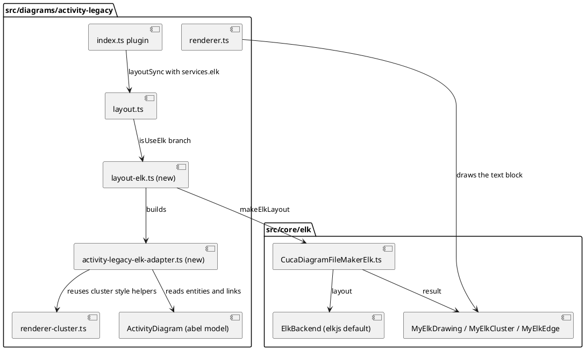

# Component map

New components are the adapter and `layout-elk.ts`; everything under `src/core/elk/` already exists and is not edited.

```plantuml
@startuml
package "src/diagrams/activity-legacy" {
  [index.ts plugin] as plugin
  [layout.ts] as layout
  [layout-elk.ts (new)] as lelk
  [activity-legacy-elk-adapter.ts (new)] as adapter
  [renderer.ts] as renderer
  [renderer-cluster.ts] as rcluster
  [ActivityDiagram (abel model)] as model
}
package "src/core/elk" {
  [CucaDiagramFileMakerElk.ts] as maker
  [MyElkDrawing / MyElkCluster / MyElkEdge] as drawing
  [ElkBackend (elkjs default)] as backend
}
plugin --> layout : layoutSync with services.elk
layout --> lelk : isUseElk branch
lelk --> adapter : builds
adapter --> model : reads entities and links
adapter --> rcluster : reuses cluster style helpers
lelk --> maker : makeElkLayout
maker --> backend : layout
maker --> drawing : result
renderer --> drawing : draws the text block
@enduml
```
