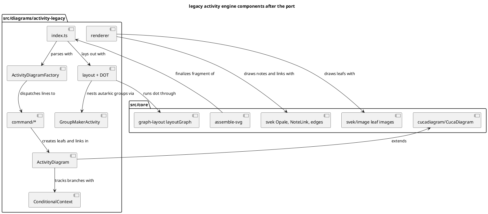

# Component map

The ported files and the shared seams they use. The engine imports from `src/core/` only.

```plantuml
@startuml
title legacy activity engine components after the port
package "src/diagrams/activity-legacy" {
  [index.ts] as idx
  [ActivityDiagramFactory] as fac
  [command/*] as cmd
  [ActivityDiagram] as dia
  [ConditionalContext] as ctx
  [layout + DOT] as lay
  [GroupMakerActivity] as gma
  [renderer] as ren
}
package "src/core" {
  [cucadiagram/CucaDiagram] as cuca
  [svek/image leaf images] as img
  [svek Opale, NoteLink, edges] as svek
  [graph-layout layoutGraph] as lg
  [assemble-svg] as asm
}
idx --> fac : parses with
fac --> cmd : dispatches lines to
cmd --> dia : creates leafs and links in
dia --> cuca : extends
dia --> ctx : tracks branches with
idx --> lay : lays out with
lay --> gma : nests autarkic groups via
lay --> lg : runs dot through
ren --> img : draws leafs with
ren --> svek : draws notes and links with
asm --> idx : finalizes fragment of
@enduml
```
