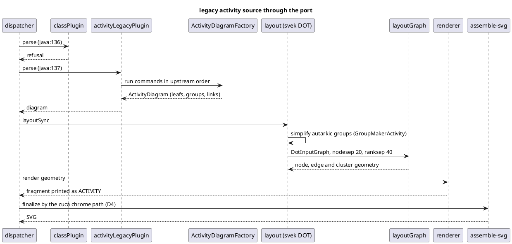

# Data flow

One legacy source from `renderSync` to SVG after T3a. The factory slot decides which engine sees the source first
(D3); svek layout runs through the one dot-engine seam (D2, D5).

```plantuml
@startuml
title legacy activity source through the port
participant "dispatcher" as disp
participant "classPlugin" as cls
participant "activityLegacyPlugin" as leg
participant "ActivityDiagramFactory" as fac
participant "layout (svek DOT)" as lay
participant "layoutGraph" as lg
participant "renderer" as ren
participant "assemble-svg" as asm
disp -> cls : parse (java:136)
cls --> disp : refusal
disp -> leg : parse (java:137)
leg -> fac : run commands in upstream order
fac --> leg : ActivityDiagram (leafs, groups, links)
leg --> disp : diagram
disp -> lay : layoutSync
lay -> lay : simplify autarkic groups (GroupMakerActivity)
lay -> lg : DotInputGraph, nodesep 20, ranksep 40
lg --> lay : node, edge and cluster geometry
disp -> ren : render geometry
ren --> disp : fragment printed as ACTIVITY
disp -> asm : finalize by the cuca chrome path (D4)
asm --> disp : SVG
@enduml
```
